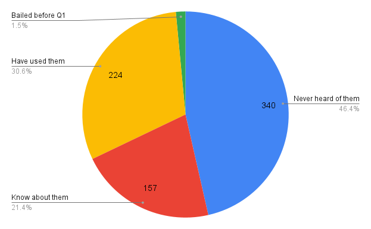
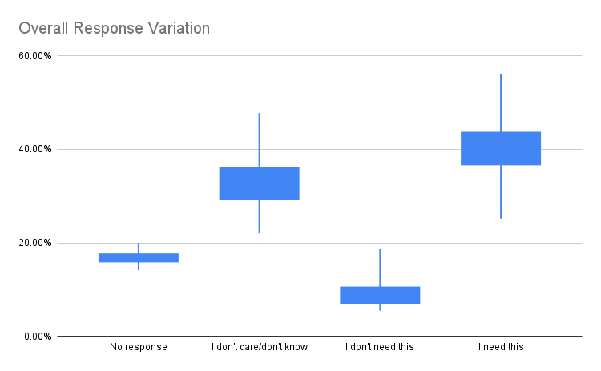
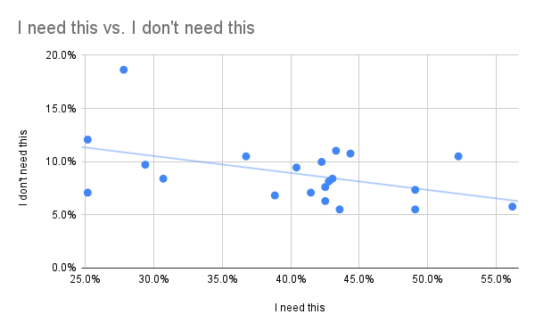

# Interpretation

See [the README](https://github.com/web-platform-dx/developer-research/blob/main/mdn-short-surveys/2023-03-31-web-components/README.md) for more information on the questions asked and the survey period.

## Results of Web Components Short Survey

Question 1 - What's your experience with Web Components (custom elements, shadow DOM, etc.)?:

| Experience          | Responses   | Percent       |
| ------------------- | --- | ------ |
| Never heard of them | 340 | 46.45% |
| Know about them     | 157 | 21.45% |
| Have used them      | 224 | 30.60% |
| Bailed before Q1    | 11  | 1.50%  |
| **Total**    | **732**  | **100%**  |

Question 2 - For your needs as a developer, which Web Components features should be improved across browsers in the coming year? This means enabling support or fixing bugs.

| Overall Q2 responses                             | No response | I don't care/don't know | I don't need this | I need this |
| ------------------------------------------------ | ----------- | ----------------------- | ----------------- | ----------- |
| Custom attributes                                | 16.0%       | 22.0%                   | 5.8%              | 56.2%       |
| Theming                                          | 14.2%       | 23.1%                   | 10.5%             | 52.2%       |
| Declarative custom elements                      | 17.1%       | 28.3%                   | 5.5%              | 49.1%       |
| HTML modules                                     | 15.2%       | 28.3%                   | 7.3%              | 49.1%       |
| Styling children of slotted content              | 15.5%       | 29.4%                   | 10.8%             | 44.4%       |
| Template instantiation and updating              | 17.6%       | 33.3%                   | 5.5%              | 43.6%       |
| Children changed callback                        | 16.5%       | 29.1%                   | 11.0%             | 43.3%       |
| CSS Properties and Values API inside shadow root | 17.6%       | 31.0%                   | 8.4%              | 43.0%       |
| Lazy custom element definitions                  | 16.5%       | 32.5%                   | 8.1%              | 42.8%       |
| Constructable stylesheets & adoptedStyleSheets   | 17.6%       | 32.3%                   | 7.6%              | 42.5%       |
| Declarative CSS modules                          | 16.0%       | 35.2%                   | 6.3%              | 42.5%       |
| Declarative shadow DOM                           | 16.0%       | 31.8%                   | 10.0%             | 42.3%       |
| Custom CSS state                                 | 15.5%       | 36.0%                   | 7.1%              | 41.5%       |
| CSS module scripts                               | 15.5%       | 34.6%                   | 9.4%              | 40.4%       |
| Form-Associated custom elements                  | 19.2%       | 35.2%                   | 6.8%              | 38.8%       |
| Open styling of shadow roots                     | 17.6%       | 35.2%                   | 10.5%             | 36.7%       |
| Imperative slot assignment                       | 17.6%       | 43.3%                   | 8.4%              | 30.7%       |
| Scoped element registries                        | 19.2%       | 41.7%                   | 9.7%              | 29.4%       |
| Custom SVG/MathML elements                       | 16.5%       | 37.0%                   | 18.6%             | 27.8%       |
| Composed selection                               | 19.9%       | 47.8%                   | 7.1%              | 25.2%       |
| Cross-root ARIA                                  | 18.4%       | 44.4%                   | 12.1%             | 25.2%       |

Question 2, for only users who said their experience with Web Components was "Know about them":

| Just "Know about them" users                     | No response | I don't care/don't know | I don't need this | I need this |
| ------------------------------------------------ | ----------- | ----------------------- | ----------------- | ----------- |
| Custom attributes                                | 15.3%       | 21.7%                   | 8.3%              | 54.8%       |
| Theming                                          | 13.4%       | 30.0%                   | 10.9%             | 45.9%       |
| HTML modules                                     | 14.0%       | 35.0%                   | 6.4%              | 44.6%       |
| Declarative custom elements                      | 15.9%       | 36.3%                   | 5.7%              | 42.1%       |
| Lazy custom element definitions                  | 15.9%       | 35.7%                   | 7.0%              | 41.4%       |
| Declarative CSS modules                          | 15.3%       | 38.9%                   | 6.4%              | 39.5%       |
| Custom CSS state                                 | 15.9%       | 38.9%                   | 8.3%              | 37.0%       |
| Children changed callback                        | 17.2%       | 35.0%                   | 10.8%             | 36.9%       |
| Styling children of slotted content              | 15.3%       | 37.0%                   | 12.1%             | 35.7%       |
| Template instantiation and updating              | 16.6%       | 44.0%                   | 4.5%              | 35.1%       |
| Declarative shadow DOM                           | 15.9%       | 40.1%                   | 8.9%              | 35.0%       |
| Form-Associated custom elements                  | 16.6%       | 41.4%                   | 8.3%              | 33.8%       |
| CSS Properties and Values API inside shadow root | 16.6%       | 40.1%                   | 9.6%              | 33.8%       |
| CSS module scripts                               | 16.6%       | 42.0%                   | 8.3%              | 33.1%       |
| Constructable stylesheets & adoptedStyleSheets   | 17.2%       | 40.1%                   | 9.6%              | 33.1%       |
| Custom SVG/MathML elements                       | 15.3%       | 39.5%                   | 14.7%             | 30.6%       |
| Open styling of shadow roots                     | 17.9%       | 44.6%                   | 9.6%              | 28.0%       |
| Imperative slot assignment                       | 16.6%       | 49.7%                   | 8.9%              | 24.9%       |
| Cross-root ARIA                                  | 16.6%       | 48.4%                   | 12.1%             | 22.9%       |
| Scoped element registries                        | 19.1%       | 47.8%                   | 10.8%             | 22.3%       |
| Composed selection                               | 18.5%       | 54.1%                   | 6.4%              | 21.0%       |

Question 2, for only users who said their experience with Web Components was "Have used them":

| Just "Have used them" users                      | No response | I don't care/don't know | I don't need this | I need this |
| ------------------------------------------------ | ----------- | ----------------------- | ----------------- | ----------- |
| Custom attributes                                | 16.5%       | 22.3%                   | 4.0%              | 57.2%       |
| Theming                                          | 14.8%       | 18.3%                   | 10.3%             | 56.7%       |
| Declarative custom elements                      | 17.9%       | 22.8%                   | 5.4%              | 54.0%       |
| HTML modules                                     | 16.1%       | 23.7%                   | 8.1%              | 52.2%       |
| Styling children of slotted content              | 15.6%       | 24.1%                   | 9.8%              | 50.5%       |
| Template instantiation and updating              | 18.3%       | 25.9%                   | 6.3%              | 49.6%       |
| CSS Properties and Values API inside shadow root | 18.3%       | 24.6%                   | 7.6%              | 49.6%       |
| Constructable stylesheets & adoptedStyleSheets   | 17.9%       | 26.8%                   | 6.3%              | 49.1%       |
| Children changed callback                        | 16.1%       | 25.0%                   | 11.2%             | 47.8%       |
| Declarative shadow DOM                           | 16.1%       | 25.9%                   | 10.7%             | 47.3%       |
| CSS module scripts                               | 14.7%       | 29.5%                   | 10.3%             | 45.5%       |
| Declarative CSS modules                          | 16.5%       | 32.6%                   | 6.3%              | 44.7%       |
| Custom CSS state                                 | 15.2%       | 33.9%                   | 6.3%              | 44.7%       |
| Lazy custom element definitions                  | 17.0%       | 30.4%                   | 8.9%              | 43.8%       |
| Open styling of shadow roots                     | 17.4%       | 28.6%                   | 11.2%             | 42.9%       |
| Form-Associated custom elements                  | 21.0%       | 30.8%                   | 5.8%              | 42.4%       |
| Imperative slot assignment                       | 18.3%       | 38.9%                   | 8.1%              | 34.8%       |
| Scoped element registries                        | 19.2%       | 37.5%                   | 8.9%              | 34.4%       |
| Composed selection                               | 21.0%       | 43.3%                   | 7.6%              | 28.1%       |
| Cross-root ARIA                                  | 19.6%       | 41.5%                   | 12.1%             | 26.8%       |
| Custom SVG/MathML elements                       | 17.4%       | 35.3%                   | 21.4%             | 25.9%       |

## Plots

### Overall

### Variation

### Need vs. Don't Need

### Split by Feature

## Analysis

### Overall Trends

The survey received 732 responses, of which over 50% were at least familiar with Web Components. The targeting of the survey was therefore fairly good. Roughly 30% of respondents report having used Web Components.

Of the respondents that were familiar with Web Components (unfamiliar respondents exited the survey after Q1), about 85% went through the trouble to select answers for all 21 features. So initial fears about having too many feature options appear unfounded. However, [it appears](#variation) that many respondents voted either "I need this" or "I don't care or don't know", leading to a low rate for "I don't need this". That might imply that many respondents just clicked "I need this" for the features they had heard of, and didn't bother to try to rank features. Perhaps a better way to ask this type of question in the future would require respondents to force-rank features. Thought that likely leads to a more cumbersome survey and therefore results in lower response rates.

### Individual Feature Analysis

The top 5 features getting an "**I need this**" vote were:

1. Custom attributes
2. Theming
3. Declarative custom elements
4. HTML modules
5. Styling children of slotted content

The top 5 features getting an "**I don't need this**" vote were:

1. Custom SVG/MathML elements
2. Cross-root ARIA
3. Children changed callback
4. Styling children of slotted content
5. Theming

And the top 5 features getting an "**I don't care / don't know**" vote were:

1. Composed selection
2. Cross-root ARIA
3. Imperative slot assignment
4. Scoped element registries
5. Custom SVG/MathML elements

Note that Theming shows up on both the "I need this" and "I don't need this" lists. Generally, it should be expected that "I need this" and "I don't need this" would have a correlation coefficient of -1. In other words, a feature heavily-voted as "I need this" should be very lightly voted as "I don't need this". However, there is only a very weak negative correlation between these two answers, as seen in [the scatter plot](#need-vs-dont-need). One possible conclusion is again that respondents either voted "I need this" or "I don't know/care". Since the rates of "I don't need this" votes were very low generally (under 20% across the board), it seems prudent to mainly examine the rates of "I need this" voting.

The ["Split by Feature"](#split-by-feature) plot is sorted by the "I need this" responses from respondents that "Have used" Web Components. In that sort, the top 5 requested features are:

1. Custom attributes
2. Theming
3. HTML modules
4. Declarative custom elements
5. Lazy custom element definitions

This is a very similar list to the overall list, however, "Lazy custom element definitions" replaces "Styling children of slotted content". Otherwise, the rankings are quite similar between folks who "Know about" Web Components and those who "Have used them".

Interestingly, some of the [projects that have been identified](https://w3c.github.io/webcomponents-cg/2022.html) as being important projects by the Web Components community ended up receiving the lowest number of votes in this survey:

- Constructable stylesheets
- Open styling of shadow roots
- Cross-root ARIA
- Scoped custom element registries
- Composed selection

Perhaps this indicates a mismatch between the [WC community group findings](https://w3c.github.io/webcomponents-cg/2022.html) and the general developer population. Or perhaps this indicates a shortcoming of this survey, in that respondents weren't sure what some features such as "composed selection" actually meant. Only a followup survey might be able to make this more clear.

If the reason for this mismatch is indeed a lack of understanding for the things toward the bottom of the list, then perhaps an appropriate conclusion is that those items need better documentation and developer outreach.

## Future improvements

Several things might make the results of this survey more actionable:

1. Force respondents to rank features explicitly, rather than using simple "I need" and "I don't need" choices.
2. Limit the number of items, to make ranking possible.
3. (Maybe) provide links and additional documentation on each item, to reduce the number of "I don't know" responses.
4. Instead of "Don't care", use something like "I don't know what this item means". That'll disambiguate not **wanting** something from not **understanding** something.
