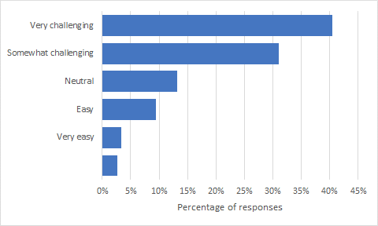
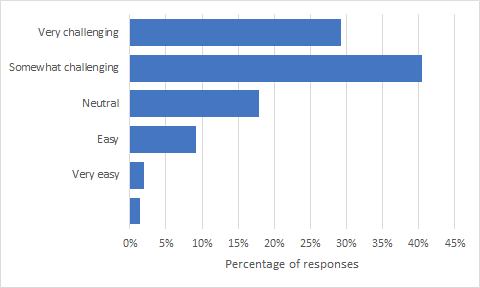
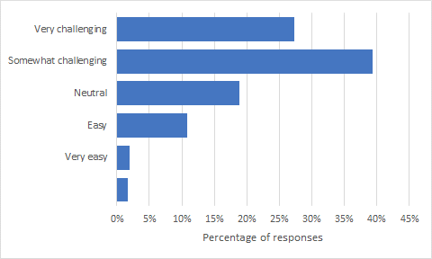
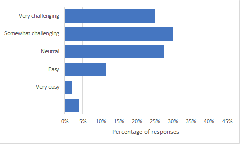
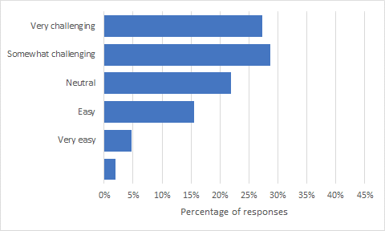
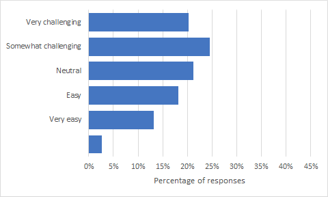

# Interpretation

See [the README](README.md) for more information on the questions asked and the survey period, and [results in CSV format](results.csv). This interpretation is provided by the program committee of the [W3C Secure the Web Forward Workshop](https://www.w3.org/2023/03/secure-the-web-forward/), who initially proposed the short survey.

## Overall analysis

The survey received **297 responses** and roughly 96% of developers selected answers for the 6 security aspects listed in the first question.

| Choice                | Percent  |
| --------------------- | -------- |
| Very challenging      | 28%      |
| Somewhat challenging  | 32%      |
| Neutral               | 20%      |
| Easy                  | 12%      |
| Very easy             | 5%       |
| _No response_         | 2%       |
| **Total**             | **100%** |

Overall, these responses suggest a clear need for better education, tools, and best practices to assist developers in detecting and preventing security vulnerabilities in their development workflows. On average, 60% of developers rated the security aspects as somewhat challenging or very challenging, while only 17% of developers rated them as easy or very easy.

## Analysis per security aspect

| Security aspect                             | Very challenging | Somewhat challenging | Neutral | Easy | Very easy | _No response_ |
| ------------------------------------------- | ---------------- | -------------------- | ------- | ---- | --------- | ------------- |
| Detecting Security Vulnerabilities          | 40%              | 31%                  | 13%     | 9%   | 3%        | 3%            |
| Understanding Security Threats              | 29%              | 40%                  | 18%     | 9%   | 2%        | 1%            |
| Understanding the Browser Security Model    | 27%              | 39%                  | 19%     | 11%  | 2%        | 2%            |
| Integrating Third Party Services            | 25%              | 30%                  | 28%     | 11%  | 2%        | 4%            |
| Keeping Frameworks and Libraries Up-to-Date | 27%              | 29%                  | 22%     | 15%  | 5%        | 2%            |
| HTTPS Configuration                         | 20%              | 25%                  | 21%     | 18%  | 13%       | 3%            |
| **Overall (average)**                       | **28%**          | **32%**              | **20%** | **12%** | **5%** | **2%**        |

The above table is sorted per descending number of "Very challenging" plus "Somewhat challenging" responses. This gives a clearer picture of the security aspects that developers find especially challenging.

## Detecting Security Vulnerabilities

Detecting security vulnerabilities introduced in the development workflow, such as cross-site scripting, appears as the most challenging security aspect in the survey: 71% of developers reported it as somewhat challenging or very challenging. It is also the only security aspect for which the number of very challenging responses (40%) exceeds that of somewhat challenging responses (31%).

## Understanding Security Threats

Second most challenging aspect is understanding security threats, with 69% of somewhat challenging and very challenging responses. Given the constantly evolving landscape of security threats, this response is not surprising. Combined with the previous aspect on finding security vulnerabilities, this suggests a clear need for better education and tools to assist developers in their development workflows.

## Understanding the Browser Security Model

Understanding the security model of web browsers is generally seen as somewhat challenging to very challenging by many developers too (66%). This response is not surprising either, given the complexity of security models and the continuous evolution of web technologies.

## Safely Integrating Third Party Services

As the fourth most challenging security aspect, safely integrating third-party services, such as login and payment systems, has received a mixed response from developers, with 55% of them rating it as somewhat challenging or very challenging, while 27% rated it as neutral.
One possible interpretation for the relatively neutral feeling is that developers may have interpreted third party services as those originating from identified companies that have a business incentive to keep their service secure and look into security vulnerabilities more thoroughly.

## Keeping Frameworks and Libraries Up-to-Date

The task of keeping frameworks and libraries up-to-date in web applications has generated mixed responses from developers as well, with 54% of developers rating it as somewhat challenging or very challenging, but also 20% as easy or very easy. This suggests that many developers find this difficult, though not as difficult as some other tasks.
One possible interpretation is that, while actually updating dependencies remains challenging, tools that alert developers about new dependency releases have now become mainstream in development workflows.

## HTTPS Configuration

Configuring the server to match the required security properties (e.g., SSL, HTTP headers) is seen as the least challenging of the security aspects listed in the survey, with 45% of developers rating it as somewhat challenging or very challenging, while 31% rate it as easy or very easy.
It would be interesting to explore the reasons why developers find this task relatively easier. It may be that services that provide servers to host web applications already take care of most configuration issues on behalf of developers, or that server configuration is now seen as a well-known task.

## Other insights from our survey responses:

Second question in the survey asked developers about other main security-related challenges that they are facing when developing and deploying Web content, using a free form text entry. Insights listed below are a more qualitative attempt at grouping this feedback into topics. Other insights could perhaps be extracted from the responses, see the [results in CSV format](results.csv) for details.

* **Keeping Up with Changes**: Many developers mention the challenge of staying updated with new security threats and technologies. This includes understanding and adapting to new standards, and the difficulty of maintaining backward compatibility with older systems.
* **Third-party Libraries and Services**: Developers are concerned about the security implications of relying on third-party code and services. This includes both understanding the security of these libraries and integrating them into their applications in a secure way. Many specifically mentioned the challenges with NPM and Content Security Policy (CSP).
* **Lack of Knowledge or Education**: Some developers noted a lack of cybersecurity content in their formal education and difficulty finding reliable, comprehensive resources for learning about web security.
* **Team Issues**: Several responses touch on the difficulty of getting a whole team to focus on security or ensuring all team members understand and can identify security risks.
* **User/Client-side Issues**: Challenges here include not being able to force clients to follow certain behaviours, dealing with end-users, and handling user inputs and content.
* **Authentication**: Implementing secure authentication flows is mentioned as a challenge, especially for developers working with certain frameworks.
* **Complexity and Specific Technical Challenges**: A variety of more specific technical challenges were mentioned, including setting up a strict-CSP header, dealing with different browser behavior for service workers, ensuring supply chain safety, and securing user content, especially from untrusted users.
* **Resources**: There are challenges around safe hosting and having resources and support for smaller developers.
* **Regulatory Compliance**: Challenges with GDPR and other regulations compliance also emerged from the responses.
* **Attacks**: Concerns about preventing different types of attacks and handling post-attack processing were mentioned.
