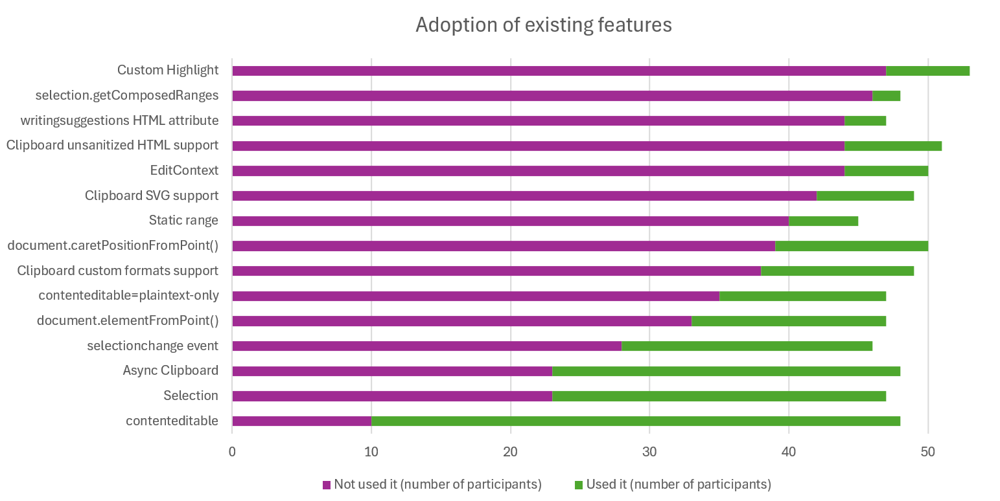
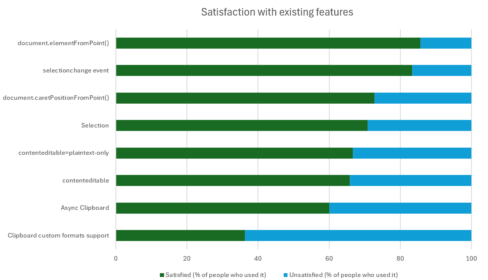
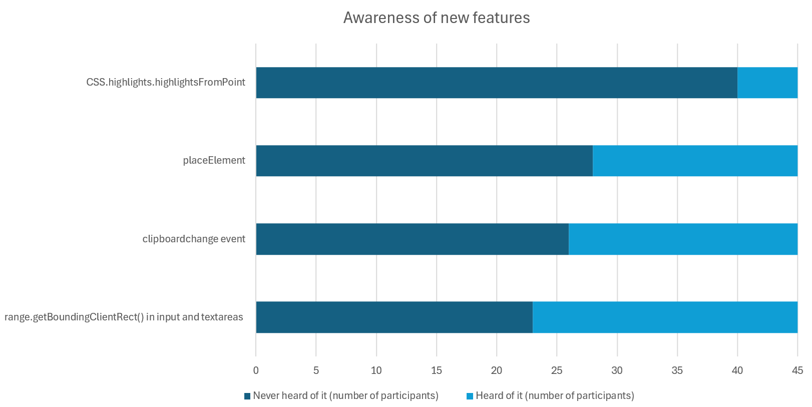
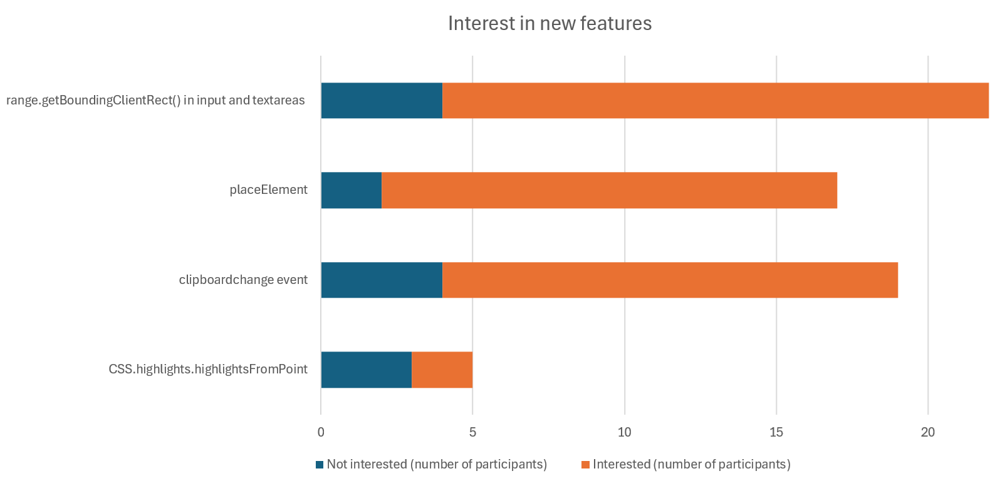

# Text editing Short Survey

## Date

Survey run between 2024-11-19 - 2024-11-25 to 10% of users on Web API pages. See [background discussion](https://github.com/web-platform-dx/developer-research/issues/34).

## Questions

1. Please share your feedback about the following features: _(each option listed with 4 choices: "Never heard of it", "Heard of it but not used it", "Used it and not satisfied", "Used it and satisfied")_
   * Custom Highlight: Format text ranges with no additional DOM node
   * EditContext: Build text editors to support advanced input methods
   * Async Clipboard: Read from and write to the system clipboard
   * Clipboard unsanitized HTML support: Read raw HTML from the clipboard
   * Clipboard custom formats support: Read and write custom data from the clipboard
   * Clipboard SVG support: Read and write SVG data from the clipboard
   * writingsuggestions HTML attribute: Toggle the browser's AI writing suggestions
   * document.caretPositionFromPoint(): Get the caret position from a point
   * document.elementFromPoint(): Get DOM elements from a point
   * Selection: Control and modify user text selections
   * selection.getComposedRanges: Get user text selections across shadow DOM
   * selectionchange event: Detect user text selection changes
   * Static range: Handle immutable text ranges effectively
   * contenteditable: HTML attribute to make text editable
   * contenteditable=plaintext-only: Edit plain text not rich text

2. Please share your feedback about the following proposals: _(each option listed with 3 choices: "Never heard of it", "Heard of it but not interested", "Heard of it and interested")_
   * CSS.highlights.highlightsFromPoint: Get custom highlights from a point
   * Support for range.getBoundingClientRect() in input and textareas
   * clipboardchange event: Detect changes to clipboard contents
   * placeElement: Allows HTML elements to be drawn on canvas

3. Are there any text or editing related features that are difficult to implement? _(free-form text)_

## Results

[Results in csv format](results.csv)

### Q1 - Existing features

| Feature | Never heard of it | Heard of it but not used it | Used it and not satisfied | Used it and satisfied | Responses |
| ------- | ----------------- | --------------------------- | ------------------------- | --------------------- | --------- |
| Custom Highlight | 33 (62.3%) | 14 (26.4%) | 3 (5.7%) | 3 (5.7%) | 53 |
| EditContext | 36 (72%) | 8 (16%) | 1 (2%) | 5 (10%) | 50 |
| Async Clipboard | 13 (27.1%) | 10 (20.8%) | 10 (20.8%) | 15 (31.3%) | 48 |
| Clipboard unsanitized HTML support | 29 (56.9%) | 15 (29.4%) | 3 (5.9%) | 4 (7.8%) | 51 |
| Clipboard custom formats support | 21 (42.9%) | 17 (34.7%) | 7 (14.3%) | 4 (8.2%) | 49 |
| Clipboard SVG support | 27 (55.1%) | 15 (30.6%) | 2 (4.1%) | 5 (10.2%) | 49 |
| writingsuggestions HTML attribute | 36 (76.6%) | 8 (17%) | 1 (2.1%) | 2 (4.3%) | 47 |
| document.caretPositionFromPoint() | 33 (66%) | 6 (12%) | 3 (6%) | 8 (16%) | 50 |
| document.elementFromPoint() | 27 (57.4%) | 6 (12.8%) | 2 (4.3%) | 12 (25.5%) | 47 |
| Selection | 9 (19.1%) | 14 (29.8%) | 7 (14.9%) | 17 (36.2%) | 47 |
| selection.getComposedRanges | 39 (81.3%) | 7 (14.6%) | 1 (2.1%) | 1 (2.1%) | 48 |
| selectionchange event | 16 (34.8%) | 12 (26.1%) | 3 (6.5%) | 15 (32.6%) | 46 |
| Static range | 34 (75.6%) | 6 (13.3%) | 0 (0%) | 5 (11.1%) | 45 |
| contenteditable | 3 (6.3%) | 7 (14.6%) | 13 (27.1%) | 25 (52.1%) | 48 |
| contenteditable=plaintext-only | 22 (46.8%) | 13 (27.7%) | 4 (8.5%) | 8 (17%) | 47 |
| Total responses |  |  |  |  | 53 |

### Q2 - Proposed features

| Feature | Never heard of it | Heard of it but not interested | Heard of it and interested | Responses |
| ------- | ----------------- | ------------------------------ | -------------------------- | --------- |
| CSS.highlights.highlightsFromPoint | 40 (88.9%) | 3 (6.7%) | 2 (4.4%) | 45 |
| range.getBoundingClientRect() in input and textareas | 23 (51.1%) | 4 (8.9%) | 18 (40%) | 45 |
| clipboardchange event | 26 (57.8%) | 4 (8.9%) | 15 (33.3%) | 45 |
| placeElement | 28 (62.2%) | 2 (4.4%) | 15 (33.3%) | 45 |
| Total responses |  |  |  | 45 |

### Q3 - Feedback about features that are difficult to implement (free-form)

The following challenges were extracted from the free-form responses:

| Challenges | Responses |
| ---------- | --------- |
| Browser compat (dealing with keyboard events, clipboard, or `contenteditable` across browsers) | 4 |
| Implementing syntax highlighting | 2 |
| Not enough file type support in clipboard API | 1 |
| Hard to implement undo/redo | 1 |
| Canvas-based text editing is very complex | 1 |
| Reading from the clipboard without user intervention | 1 |
| `contenteditable` is hard to work with | 1 |
| Mobile text selection is difficult | 1 |
| Selection preservation after DOM mutations | 1 |
| Unrelated answers | 4 |
| No issues | 2 |

## Interpretation

This interpretation is provided by Patrick Brosset and Taylore Givens, of Microsoft Edge, who initially proposed the short survey.

### Statistical significance

The survey received **62 responses**, which means that the results may not be representative of the wider developer community. However, the features and proposals listed in the survey are quite specific and targeted at a niche audience, so the responses are likely to be more representative of the developers who are either actively working on text editing features, or interested in them.

### Adoption of existing features

The chart above shows the list of features and, for each, how many participants said they had used it vs. how many said they hadn't.

It shows that the vast majority of the text & editing features are not used by the participants. The exception are **Async Clipboard** and **Selection**, which are just above the 50% mark, and **contenteditable** which is used by ~80% of the participants.

### Satisfaction with existing features

The chart above only shows the features that more than 10 participants said they had used. For each of these features, the chart shows the ratio of participants that are satisfied vs. unsatisfied with the feature.

Participants are satisfied with most of the features they use (between 60% and 85%, with the variance likely not statistically significant). The only exception is **Clipboard custom formats support**, with 64% of participants being unsatisfied with it.

### Awareness of new features

The chart above shows the list of proposed features and, for each, how many participants said they had heard of it vs. how many said they hadn't.

All features have more than 50% of participants who have never heard of them, with **CSS.highlights.highlightsFromPoint** being the least known feature with almost 90% of participants who have never heard of it.

### Interest in new features

The chart above shows the list of proposed features and, for each, how many participants said they were interested vs. how many said they weren't.

While there is clear interest in **range.getBoundingClientRect() in input and textareas**, **placeElement**, and **clipboardchange event**, the very few participants who have heard of **CSS.highlights.highlightsFromPoint** are not particularly interested in it.
