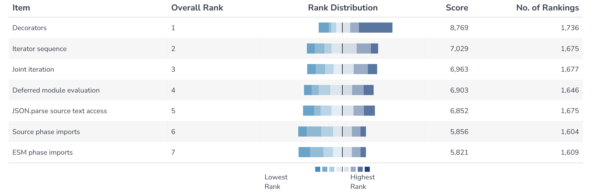
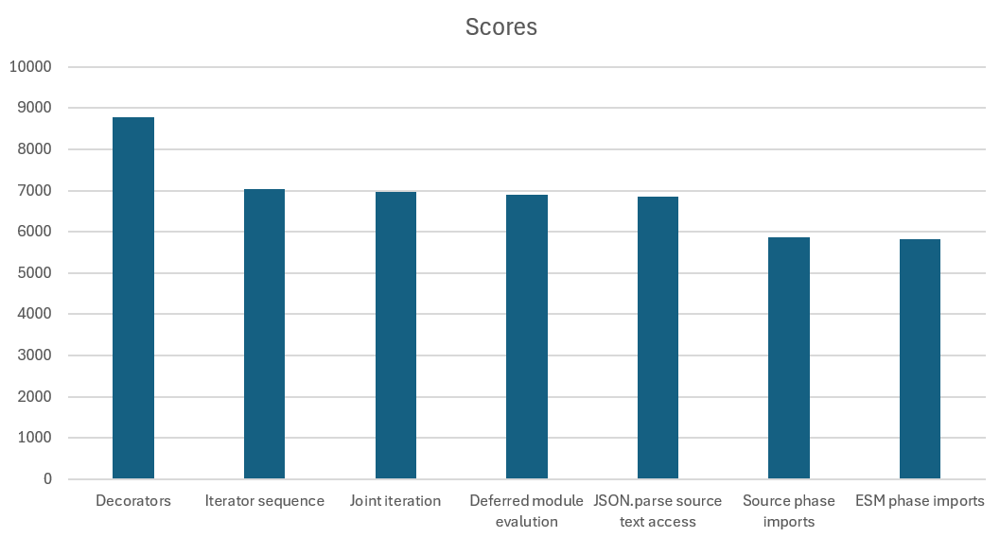
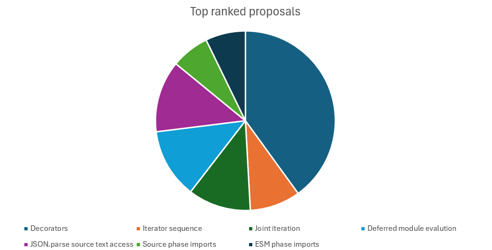

# TC39 proposals Short Survey

## Date

The survey ran between 2025-04-07 - 2025-04-15 and was shown to all users of MDN JavaScript pages.

## Questions

1. Please rank these proposals in order of preference for inclusion in JavaScript:
   
   _Respondents were asked to drag and drop the following proposals into a ranked list. Not all proposals had to be ranked and respondents could rank as few or as many proposals as they wanted._

   _Respondents were also presented with a link to [a document which described the proposals](https://docs.google.com/document/d/1DMPXS4Po5Nd-l0mIEYj78H1S_R5FrB7CkHbluhqQPVo/edit)._
   
   _The proposals were presented in a random order for each respondent._

   * Decorators
   * ESM phase imports
   * Deferred module evaluation
   * JSON.parse source text access
   * Source phase imports
   * Joint iteration
   * Iterator sequence

2. Please tell us more about how your top ranking option would help you as a developer

   _Free-form text_

## Results

The survey received **2220** responses.

[Results in csv format](results.csv)

## Interpretation

### Q1 - Proposal ranking

Here is the final ranking of the proposals:

| Proposal | Overall rank | Score | No. of rankings |
| --- | --- | --- | --- |
| Decorators | 1 | 8769 | 1736 |
| ESM phase imports | 2 | 7029 | 1675 |
| Deferred module evaluation | 3 | 6963 | 1677 |
| JSON.parse source text access | 4 | 6903 | 1646 |
| Source phase imports | 5 | 6852 | 1675 |
| Joint iteration | 6 | 5856 | 1604 |
| Iterator sequence | 7 | 5821 | 1609 |

The above data shows that **Decorators** is the most highly ranked proposal.

Here is a chart comparing the scores of the proposals:

#### Per-respondent top ranked proposals

The following table and chart show how many times each proposal was selected as the top ranked proposal by respondents:

| Proposal | No. of top rankings | Percentage of top rankings |
| --- | --- | --- |
| Decorators | 757 | 40% |
| ESM phase imports | 136 | 7.2% |
| Deferred module evaluation | 238 | 12.6% |
| JSON.parse source text access | 244 | 12.9% |
| Source phase imports | 130 | 6.9% |
| Joint iteration | 214 | 11.3% |
| Iterator sequence | 172 | 9.1% |

### Q2 - Free-form text

The free-form reponses contain a lot of useful information, use cases, and nuance about what web developers want from the proposals.

_TODO_